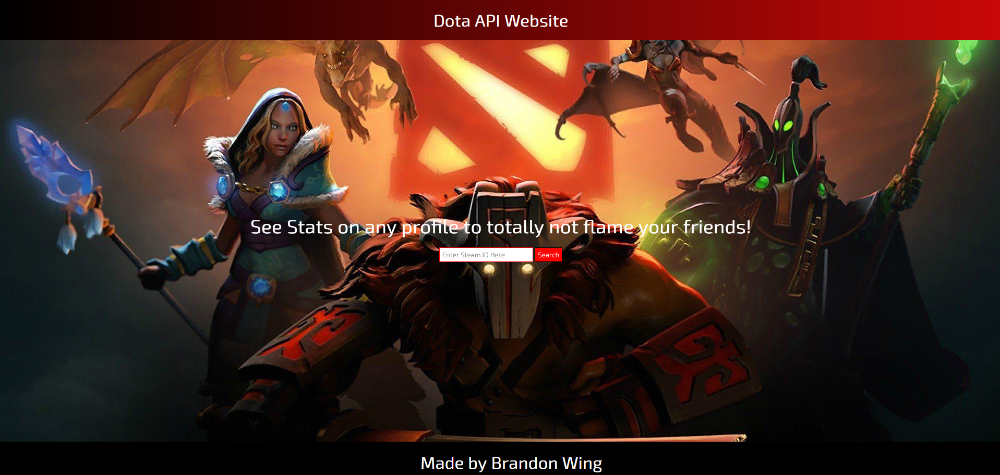
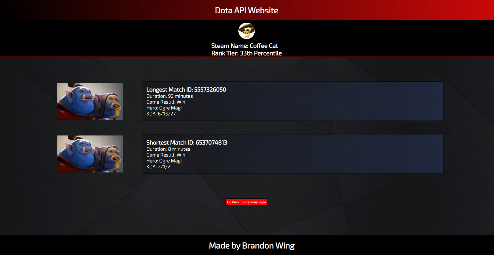

# Dota API Tracker

[Live Deploy Link](https://bwing2.github.io/brandon-dota-api-website/)

## Description

Welcome to the Dota API Tracker! This web application utilizes the OpenDota API to track and display a person's shortest and longest game based on their Steam ID number. It's built using HTML, CSS, and Javascript and serves as one of my initial projects involving a third-party API.

## Table of Contents

- [Installation](#installation)
- [Usage](#usage)
- [Features](#features)
- [License](#license)
- [Questions](#questions)

## Installation

```
1. Clone the repository from GitHub using the command `git clone https://github.com/bwing2/brandon-dota-api-website.git` in GitBash.

2. Navigate to the project directory: `cd brandon-dota-api-website`.

3. Type `code .` to open the project inside of Visual Studio Code.

4. Right click on the `index.html` file, and open it with a browser or live server.
```

## Usage

1. Type in a Steam ID number. This can be copied from a specific user's page, by viewing their steam profile. The entire https link can be posted into the search bar, and only the numbers will be searched.

2. A user's longest and shortest game stats will be shown, alongside their steam profile name and rank tier.

### Home Page



### Search Page



## Features

- **Game Tracking:** Retrieve and display information about the shortest and longest Dota games associated with a Steam ID.

- **User-Friendly Interface:** Simple and intuitive interface designed for ease of use.

## License


## Questions

You are welcome to contact me with questions using the following:

- [GitHub Profile](https://github.com/bwing2)

- [Email](mailto:brandon.wing245@gmail.com)
